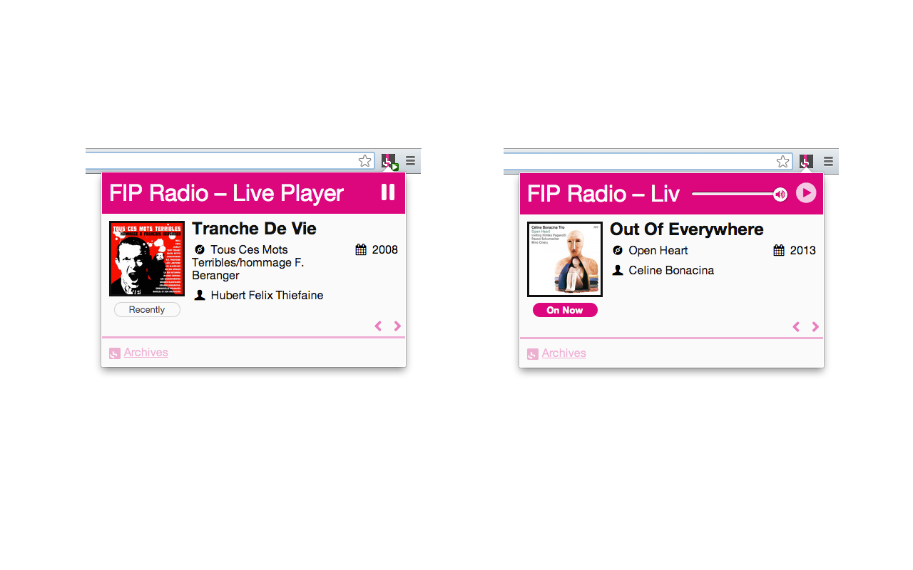

# FIP Live Radio – Chrome Extension 

This Chrome extension is dedicated to people who want to listen to
[FIP Radio](http://www.fipradio.fr/) in a very easy way, from their browser.

The goals of this extension are the following:
- recover from loss of network connection or FIP hickups;
- accessing the *Currently playing* within a single click
- scrobbling to last.fm or libre.fm

## Install

If you just want to install the extension to use it:
simply access the [Chrome Web Store extension page](https://chrome.google.com/webstore/detail/fip-live-radio/fnhlecpfnocgmmmghkjcipmhdpmpddii),
review and install it.

## Contribute

Contributions are friendly welcomed, either they are code, ideas or bug reports.

The developer toolchain relies on:
- [Grunt](http://gruntjs.com/) for automation and build process;
- [bower](http://bower.io/) for frontend components;
- [Angular](http://angularjs.org/) for dynamic HTML templating;
- [Machina.js](https://github.com/ifandelse/machina.js) for State Machine management;
- [Chrome Extension API](http://developer.chrome.com/extensions/), obviously to glue the whole stuff in your browser :-)

If you don't them perfectly… well it's a good occasion to learn!

### Checkout

1. `git clone` your fork of the repository
1. `npm install` in the project folder
1. [load the unpacked extension](http://developer.chrome.com/extensions/getstarted.html#unpacked) in Chrome/Chromium

[Chrome Dev Tools](https://developers.google.com/chrome-developer-tools/) will
help you debugging by displaying errors or the various state change of the playback.

### Testing

If you don't know anything about testing, [Travis CI](https://travis-ci.org/oncletom/chrome-fip)
takes care about each commit to ensure the app won't break.

Test should not break (but don't comment them to avoid failures...) and new features should be testable.

Current status is pretty poor but the codebase is solid. More tests will be added soon to
increase contribution safetey. As I'm using the extension everyday, I may be the first to notice any new issue ;-)
